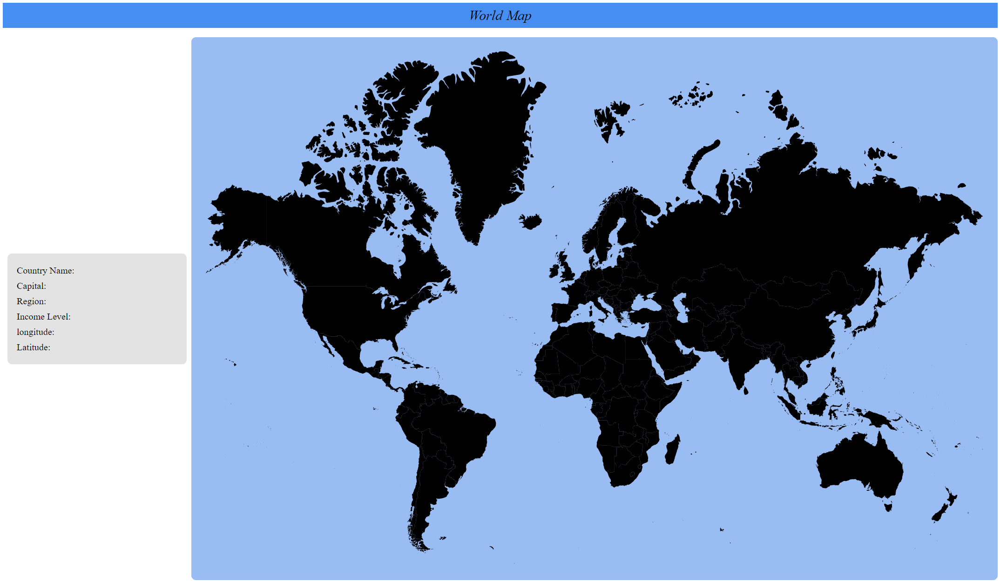
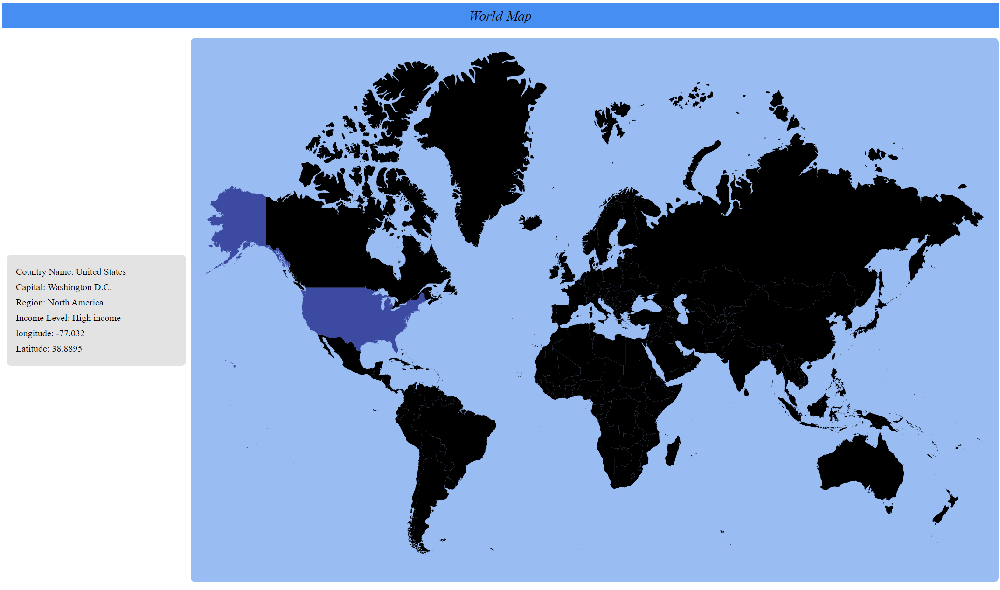
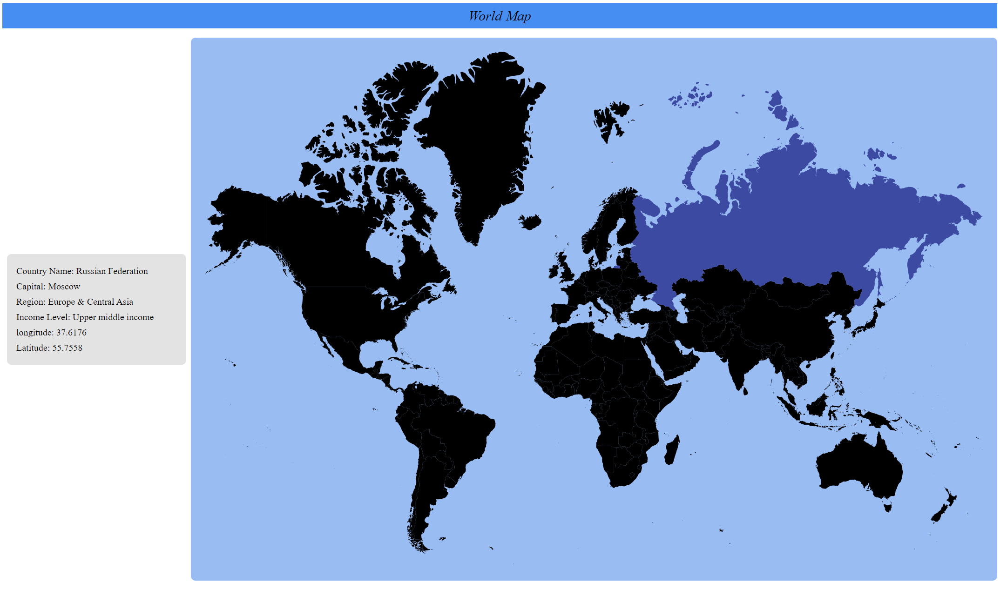

# Interactive Map

This is an Angular application featuring an interactive SVG map of the world. 
It integrates with the [Worldbank API](https://api.worldbank.org/V2/country/) to display country-specific information upon clicking 
on a country on the map.

## Features

- **Interactive SVG Map**: Clickable world map where each country is a clickable region.
- **Country Information Display**: Displays country details such as:
  - Country Name
  - Capital
  - Region
  - Income Level
  - Longitude
  - Latitude
  
- **Data Fetching**: Uses Angular's HTTP client to fetch data from the Worldbank API upon country selection.

### Screenshots

#### World Map

   

   

## Development server

Run `ng serve` for a dev server. Navigate to `http://localhost:4200/`. The application will automatically reload if you change any of the source files.

## Code scaffolding

Run `ng generate component component-name` to generate a new component. You can also use `ng generate directive|pipe|service|class|guard|interface|enum|module`.

## Build

Run `ng build` to build the project. The build artifacts will be stored in the `dist/` directory.

## Running unit tests

Run `ng test` to execute the unit tests via [Karma](https://karma-runner.github.io).

## Running end-to-end tests

Run `ng e2e` to execute the end-to-end tests via a platform of your choice. To use this command, you need to first add a package that implements end-to-end testing capabilities.

## Further help

To get more help on the Angular CLI use `ng help` or go check out the [Angular CLI Overview and Command Reference](https://angular.io/cli) page.
